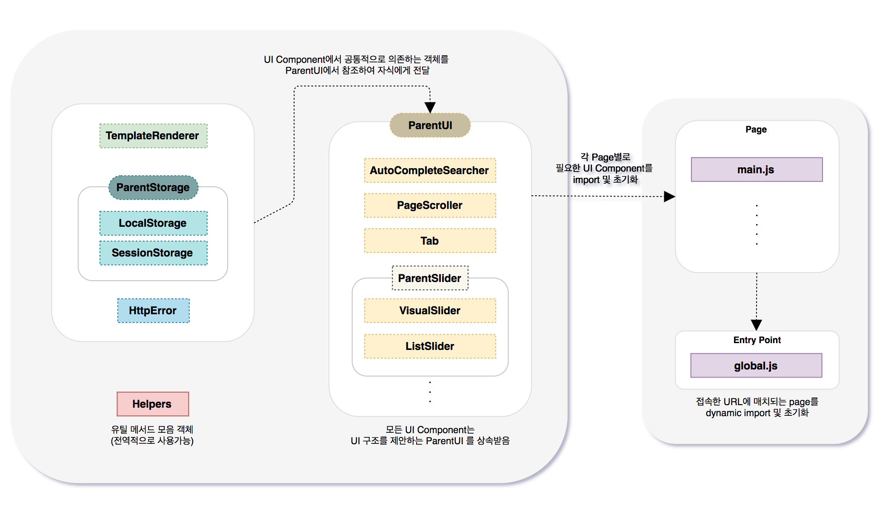

# UI Component 구조의 Web Site Project

  

## Demo & Review

* 💻 [Web Site](https://lumiloves.github.io/javascript-food/)
* 💻 [Unit Test Report](https://lumiloves.github.io/javascript-food/test/)
* 📝 Review - [Front-end 프로젝트에서의 Test Code 작성 경험기](https://lumiloves.github.io/2018/08/21/my-first-frontend-test-code-experience)

 

## 1. Introduction

### 소개 및 사용기술

* 배민찬 사이트의 디자인을 참고하여 만든 프론트엔드 프로젝트
* 개발 규모를 사이트 전체로 가정하여 구조를 설계했으며, 메인 페이지를 구현
* Javascript (ES6), CSS3 (SCSS), HTML5

### 주요특징

* 프레임웍 의존성이 없는 구조와 라이브러리를 사용하지 않은 네이티브 자바스크립트로 개발
* 프레임웍이 없기 때문에 일관성있는 객체 구조를 정의하고 협력하게 하기 위해 많은 고민(과 리팩토링)을 함
* 범용성(재사용)을 고려한 UI Component 객체 구조로 설계
* 클라이언트 측 Template Rendering를 정규식을 활용하여 구현 (단순치환, if 기능, each 기능)
* 성능을 고려한 기능 (dynamic loading, throttle, debounce)
* 테스트 코드 작성 경험 ([review](https://lumiloves.github.io/2018/08/21/my-first-frontend-test-code-experience))

 

## 2. 구조설계 및 다이어그램

### 다이어그램

### 설계 시 고려한 것들과 그 과정 => 일관성과 범용성

* 왜 **UI Component 객체 구조**로 설계했나
  * 프로젝트 특성상 View사이의 통신이 없고 독립적으로 동작하므로 UI Component 로 역할을 구분하여 객체구조를 설계하는게 적절하겠다고 판단
* **일관성**있는 코드를 작성하기 위해 노력한 이유
  * 프레임웍에 의존하지 않기 때문에 **이 프로젝트만의 규칙**이 있어야 했다.
  * 그래서 가장 중요하게 생각한 것은, 각 컴포넌트들이 일관성있게 구성되어 어떻게 협력할 지 예상이 쉽게 만드는 일이었음
  * 이렇게 되면, 코드를 파악하기 쉬워져서 새로 추가되는 객체를 어떻게 만들어야 할 지 예상할 수 있고 수정이 필요할 때 어디를 고칠 지 파악이 쉬워진다. 결론적으로 유지보수하기가 좋아진다.
* **범용성**있는 Component도 고민해 봄
  * 인스턴스 생성시 주입받을 데이터가 무엇이고, 데이터를 어떤 형태로 관리하고 활용할 것인가
  * 어떤 조건이 변할 수 있는지 예측하여, 옵션으로 받을지
  * 여러 번 사용할 수 있는지
  * DOM 객체의 의존은 어느 정도 수준으로 할 것인지
  * 인스턴스 생성시 주입받는 옵션객체는 이해하기 쉬운지
* 여러 번의 **리팩토링**
  * 코드의 일관성, 범용성을 고려하다보니 여러 번의 리팩토링을 할 수 있었는데
  * 그 과정 중에서 객체의 역할을 어떻게 나누고 정의할 것인지, 그 역할의 책임에 따라 협력이 어떻게 결정되는지에 대해 충분히 고민해보고 뒤엎고 다시 만드는 시간을 반복함
* 그 결과 아래와 같은 규칙을 만들 수 있었음

 

## 3. 프로젝트 공통 규칙

### 규칙
* 부모 객체는 (ParentUI, ParentStorage)
  * 구조를 제안하고 검증하는 기능을 메인 역할로 정의 
* UI Component는 
  * 항상 구조를 제안하는 ParentUI를 상속받아야 하고
  * 초기화 시에 협력하는 객체정보만 받고, 실제로 필요한 시점에 인스턴스를 생성하여 사용
  * 생성 후 초기화하는 메서드(init)를 별도 분리하여 제작하고, 사용하는 페이지 스크립트에서 init을 호출
  * 객체 내 메서드의 나열을 의미있게 영역별로 나누어 정렬 (UI라면 보통 해당되는 일정한 라이프 사이클과 유사하게)
    * 영역: Initailize / Storage / Request / Rendering / UI / Event
* DOM 객체 의존은 Wrapper 객체만 주입받음
  * 내부 구조가 일관되게 작성되어 있다는 것을 가정하에 코드 작성 
  * 너무 완벽하게 의존성을 없애기 위해 수많은 DOM을 주입받는게 과연 좋을까 고민했을 때, 
  * 사용하는 개발자의 입장에서 학습하고 선언할 파라메터가 많아지는 문제가 더 안 좋다고 판단.
  * html 구조에 대한 컨벤션을 약속하고 Wrapper 옵션을 하나만 받아서 약속된 구조에 대해 코드를 짜는 방향으로 선택
* Storage는
  * TemplateRendererd와 함께 이 사이트에서 공통으로 사용하기로 약속한 객체로써 ParentUI에서 제안해놓았으나
  * 여러가지 종류의 Storage (localStorage, sessionStorage, IndexedDB 등)가 선택될 경우를 대비해
  * ParentStorage에서 제안하는 공통 인터페이스로 메서드를 만들어
  * 가져다 쓰는 UI 측에서는 storage의 종류에 상관없이 같은 메서드 이름을 사용해서 쓸 수 있게 함
* 기타 규칙
  * 폴더 구조를 의미있는 영역으로 나누어, 파일명만 보더라도 역할에 대한 이해를 도움
  * html selector와 유사한 네이밍 일관성 (Wrapper는 Box로, Wrapper내 자식들은 Item으로)
  * 추상화 수준이 높은 메서드를 상위에 배치

### 실행 Flow

1. 접속한 url 정보를 분석하여, 매치되는 페이지의 스크립트를 import
2. Domcontentloaded시 매치된 페이지 객체 초기화
3. 페이지별로 선언된 UI Component의 instance를 모두 초기화

 

## 4. Component별 주요기능

### UI Component

* Slider (VisualSlider, ListSlider)
  * throttling을 이용해 애니메이션 동작시간 동안 또 다른 sliding 이벤트를 발생시키지 않도록 함
  * DOM 조작없이 CSS3(transform, animation)로 무한 슬라이딩 구현
  * Dot 버튼을 이용해 클릭된 인덱스의 슬라이드를 바로 노출
  * ListSlider의 경우 한 슬라이드에 노출되는 아이템 갯수를 옵션으로 받아 유동적으로 사용가능하게 함
* Tab
  * 로딩 시 랜덤으로 선택된 탭을 활성화 시킴
  * 로딩 이후에 비동기로 요청한 데이터를 통해서 컨텐츠 렌더링
  * 탭 버튼을 누르면 Event delegation을 통해 현재의 target index를 확인하고 그에 해당하는 컨텐츠 그룹을 노출시킴
* PageScroller
  * 스크롤 될 때, 스크롤러가 노출되는 Position 위치를 넘길 경우에만 노출시킴
  * up, down 버튼을 눌러서 움직이는 도중에 클릭시 기능이 실행되지 않도록 함
* AutoCompleteSearcher (자동완성검색)
  * 검색창에 focus가 일어날 때 script를 로딩하여 객체 생성 및 초기화 (lazy loading)
  * 가장 다양한 인터랙션이 일어나는 UI로써 
  * 다양한 키보드 이벤트 (keyup, keydown, input)의 차이점을 알고 역할에 맞게 listener 함수를 분리함
  * 검색어를 입력할 때
    * input 이벤트로 텍스트값이 변화할 때마다 검색요청을 하고 결과목록을 렌더링
    * 응답 데이터는 만료기간과 함께 캐싱해 둠.
    * debouncing을 이용해 keyboard 이벤트가 연속하여 발생시 마지막 실행시점에 대한 요청만 실행하게 함
  * 최근 검색어는 
    * 검색어로 submit이벤트를 날릴 경우 저장되며
    * 값이 비어있을 때 최근검색어가 노출

### UI 보조 Component

* TemplateRenderer
  * 클라이언트 측 Template Rendering를 정규식을 활용하여 구현
  * 템플릿 문법은 handlebars와 유사하게 구성해 보았음
  * 단순한 값 치환, if 기능, each 기능을 제공
* Storage
  * 서버 응답 데이터를 캐시해 놓거나, 최근 검색어를 저장할 때 사용
  * 응답데이터는 저장만료시간을 같이 저장하여, 만료된 데이터를 체크하여 새로 요청을 하도록 도움
* HttpError
  * 실제 프로젝트에서 HTTP Error에 대한 컨벤션이 있을 것을 가정하여
  * HttpError객체를 만들어 에러핸들링을 좀 더 일관적으로 할 수 있게 만들어 봄

 

## 5. 할 수 있게 된 것

* 코딩하기 전에 먼저 설계하는 습관이 생기고, **나만의 설계방식**이 생김
  * 객체의 역할을 먼저 분리해보고, 객체별 메서드 이름으로 수도코드 작성
  * 인터페이스는 사용측 코드를 먼저 구성해보고 내부 코드를 설계하는 것이 더 쉬웠음
  * 이 때 메서드 이름이 잘 읽히도록 계속 검토하는데, 이름을 잘 쓰려면 한가지 목적의 메서드로 쪼개야 하고, 그러면 이름이 주석처럼 읽혀서 예전보다 실제 주석이 많이 필요 없어졌다.

* **리팩토링**을 통해 여러 번 설계를 변경하고 코드에 대한 고민을 충분히 해본 경험 => 특히 **의존성관리 / 추상화 / 코드 일관성** 지점에서..
  * 바로 정답을 찾아서 따라하기보다는 삽질하고 수정하는 데 충분한 시간을 보내면서 
    * 이미 만들어진 패턴들에 의존하지 않고, 내가 이 프로젝트 안에서 가장 적합하다고 여기는 구조를 계속 고민하고 다듬으며 여러 번의 리팩토링 과정을 경험
  * 객체가 협력할 때 의존을 어떻게 잘 보여주고, 낮출 것인가
    * 의존하는 객체를 주입받아 사용하고, 주입형태는 어떤 식으로 할 것인지
    * 의존성이 쉽게 보이게 하기 위해, es module과 destructuring을 적극 활용하고 부모에게 상속받아 사용하는 메서드는 자식객체의 메서드로 한번 더 감싸 의존을 알리는 코드로 만듦
  * 일관성있는 추상화 레벨을 맞추기
    * 처음에는 추상화 수준을 적당히 나누고 서술하는게 가장 어려웠는데 이제 잘 할 수 있게 됨
    * 제일 먼저 한 가지 작업만 하도록 메서드를 잘 쪼개는게 필요하고,
    * 그러다 보면 추상화 수준이 나뉠 수 밖에 없는데 함수 내 추상화수준이 동일한 레벨로 구성되도록 하여 일관성있고 가독성이 높은 코드를 제작하는 데 시간을 들임
  * 코드 일관성 / 코드 가독성
    * 메소드들의 나열을 의미있게 영역별로 정렬하거나, 네이밍을 통일성있게 사용하고, 공백 사용을 일관성있고 보기 좋게 정렬하려 노력했고
    * 메서드가 한가지 역할을 하고 그 역할을 잘 보여주는 이름을 지었는가? 를 고민했고
    * 뎁스를 깊게 쓰지 않는 식으로 코드를 작성 (validation을 먼저 체크하여 아닐경우 if return;으로 뎁스를 줄인다던가, if else를 많이 사용하지 않게 한다던가)
  * 덤으로 '객체지향의 사실과 오해'라는 책의 내용 일부를 경험으로 이해하며 느낄 수 있게 되었다.
* 예전보다 **디버깅**을 좀 더 잘하게 됨 
  * console.log에서 벗어나 Debugging Tool을 활용하여 버그를 찾아내는 습관을 들였고
  * Tool 안의 Call Stack이나 Scope Chain이 동작하는 과정을 함께 관찰하면서 디버깅을 할 수 있었고
  * 그 결과 버그를 찾는 시간을 줄인 것
* **테스트 코드**를 제작해 보면서
  * 좋은 코드와 테스트하기 쉬운 코드와의 관계를 느낄 수 있었고,
  * 더 좋은 코드 품질에 대한 욕심이 생겼으며
  * 테스트코드를 작성해둔 후에, 기능 수정을 해보니 
    * 그 전에는 구현코드의 기능을 수정한 뒤 잘 돌아가면 끝이었는데, 이제는 수정사항에 대해 실패한 테스트코드를 같이 고치는 과정이 추가로 필요했고
    * 그 과정 속에서 수정된 코드에 대해 전체 구조나 흐름에서 한번 더 코드를 읽어보게 되어 의존되기 쉬운 부분에 대한 해결책도 함께 고민할 수 있었음
